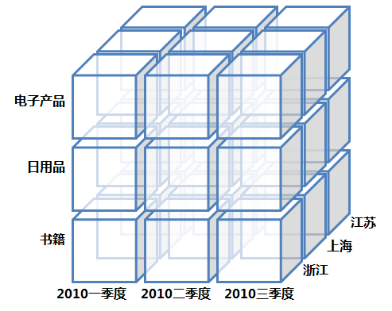
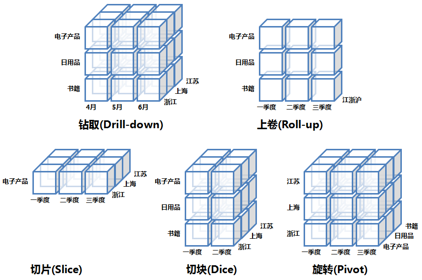

## 数据处理两大处理方式：
1. 联机事务处理OLTP（on-line transaction processing）
OLTP是传统的关系型数据库的主要应用，主要是基本的、日常的事务处理，例如银行交易。

2. 联机分析处理OLAP（On-Line Analytical Processing）
OLAP是数据仓库系统的主要应用，支持复杂的分析操作，侧重决策支持，并且提供直观易懂的查询结果。

### 数据立方体 (Data Cube)

### 主流的 OLAP 可以分为3类：多维 OLAP ( Multi-dimensional OLAP )、关系型 OLAP ( Relational OLAP ) 和混合 OLAP ( Hybrid OLAP ) 三大类。

1. 多维 OLAP ( MOLAP )
传统的 OLAP 分析方式,数据存储在多维数据集中,MOLAP 的典型代表是 Kylin 和 Druid
MOLAP 的优点和缺点都来自于其数据预处理 ( pre-processing ) 环节。数据预处理，将原始数据按照指定的计算规则预先做聚合计算，这样避免了查询过程中出现大量的临时计算，提升了查询性能，同时也为很多复杂的计算提供了支持。
但是这样的预聚合处理，需要预先定义维度，会限制后期数据查询的灵活性；如果查询工作涉及新的指标，需要重新增加预处理流程，损失了灵活度，存储成本也很高；同时，这种方式不支持明细数据的查询。
因此，MOLAP 适用于对性能要求非常高的场景。

2. 关系型 OLAP ( ROLAP )
以关系数据库为核心，以关系型结构进行多维数据的表示,通过 SQL 的 where 条件以呈现传统 OLAP 的切片、切块功能,ROLAP 的典型代表是 Presto 和 Impala。

ROLAP 不需要进行数据预处理 ( pre-processing )，因此查询灵活，可扩展性好。这类引擎使用 MPP 架构 ( 与Hadoop相似的大型并行处理架构，可以通过扩大并发来增加计算资源 )，可以高效处理大量数据。
但是当数据量较大或 query 较为复杂时，查询性能也无法像 MOLAP 那样稳定。所有计算都是临时发生 ( 没有预处理 )，因此会耗费更多的计算资源。
因此，ROLAP 适用于对查询灵活性高的场景。

3. 混合 OLAP ( HOLAP )
混合 OLAP，是 MOLAP 和 ROLAP 的一种融合.当查询聚合性数据的时候，使用MOLAP技术；当查询明细数据时，使用ROLAP技术。在给定使用场景的前提下，以达到查询性能的最优化。

### OLAP多维分析常用操作

钻取（Drill-down）：在维的不同层次间的变化，从上层降到下一层，或者说是将汇总数据拆分到更细节的数据，比如通过对2010年第二季度的总销售数据进行钻取来查看2010年第二季度4、5、6每个月的消费数据，如上图；当然也可以钻取浙江省来查看杭州市、宁波市、温州市……这些城市的销售数据。

上卷（Roll-up）：钻取的逆操作，即从细粒度数据向高层的聚合，如将江苏省、上海市和浙江省的销售数据进行汇总来查看江浙沪地区的销售数据，如上图。

切片（Slice）：选择维中特定的值进行分析，比如只选择电子产品的销售数据，或者2010年第二季度的数据。

切块（Dice）：选择维中特定区间的数据或者某批特定值进行分析，比如选择2010年第一季度到2010年第二季度的销售数据，或者是电子产品和日用品的销售数据。

旋转（Pivot）：即维的位置的互换，就像是二维表的行列转换，如图中通过旋转实现产品维和地域维的互换.

##  OLAP与OLTP
| 数据处理类型 | OLTP | OLAP |
| ------ | --------- | -------- |
| 面向对象 | 业务开发人员 | 分析决策人员 |
| 功能实现 | 日常事务处理 | 面向分析决策 |
| 数据设计 | 面向应用 | 面向主题 |
| 数据模型 | 关系模型 | 多维模型 |
| 数据量  | 几条或几十条记录 | 百万千万条记录 |
| 操作类型 | 查询、插入、更新、删除 | 查询为主 |

https://zhuanlan.zhihu.com/p/266402829
https://dbaplus.cn/news-73-3346-1.html
https://ververica.cn/developers/olap-engine-performance-optimization-and-application-cases/