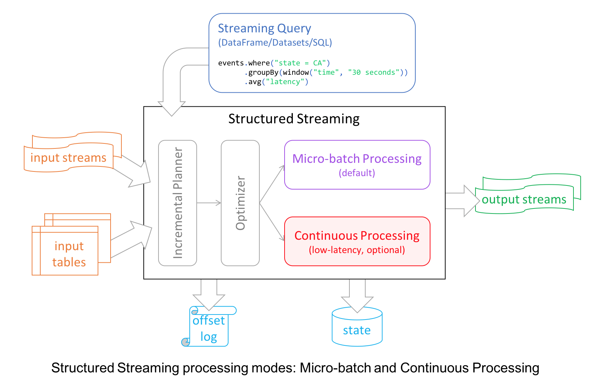
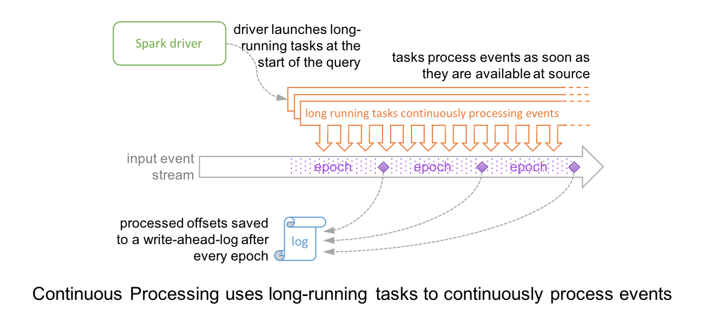
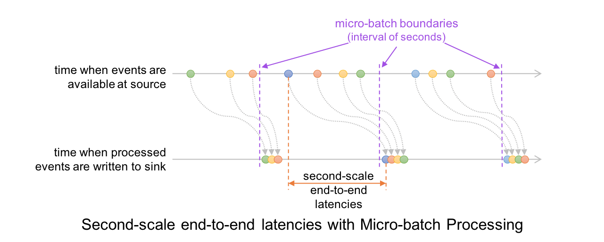
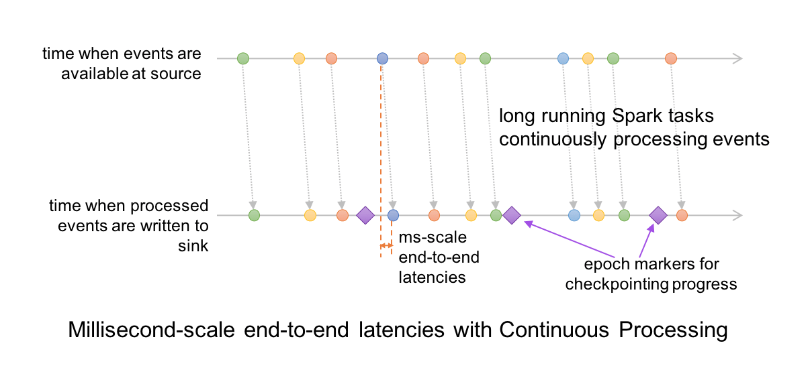

## 是时候放弃 Spark Streaming, 转向 Structured Streaming   https://github.com/legendtkl/paper_reading

正如在之前的那篇文章中 [Spark Streaming 设计原理](https://zhuanlan.zhihu.com/p/47838090) 中说到 Spark 团队之后对 Spark Streaming 的维护可能越来越少，Spark 2.4 版本的 [Release Note](http://spark.apache.org/releases/spark-release-2-4-0.html) 里面果然一个 Spark Streaming 相关的 ticket 都没有。相比之下，Structured Streaming 有将近十个 ticket 说明。所以各位同学，是时候舍弃 Spark Streaming 转向 Structured Streaming 了，当然理由并不止于此。我们这篇文章就来分析一下 Spark Streaming 的不足，以及Structured Streaming 的设计初衷和思想是怎么样的。文章主要参考今年（2018 年）sigmod 上面的这篇论文：***Structured Streaming: A Declarative API for Real-Time
Applications in Apache Spark*** 。

首先可以注意到的了论文标题中的 ***Declarative API***，中文一般叫做声明式编程 API。一般直接看到这个词可能不知道什么意思，但是当我们列出他的对立单词：***Imperative API***，中文一般叫命令式编程 API，仿佛一切都明了了。是的，没错，***Declarative*** 只是表达出我们想要什么，而 ***Imperative*** 则是说为了得到什么我们需要做哪些东西一个个说明。举个例子，我们要一个糕点，去糕点店直接去定做告诉店员我们要什么样式的糕点，然后店员去给我们做出来，这就是 ***Declarative***。而 ***Imperative*** 对应的就是面粉店了。

## 0. Spark Streaming 不足

在开始正式介绍 Structured Streaming 之前有一个问题还需要说清楚，就是 Spark Streaming 存在哪些不足？总结一下主要有下面几点：

**使用 Processing Time 而不是 Event Time**。首先解释一下，Processing Time 是数据到达 Spark 被处理的时间，而 Event Time 是数据自带的属性，一般表示数据产生于数据源的时间。比如 IoT 中，传感器在 12:00:00 产生一条数据，然后在 12:00:05 数据传送到 Spark，那么 Event Time 就是 12:00:00，而 Processing Time 就是 12:00:05。我们知道 Spark Streaming 是基于 DStream 模型的 micro-batch 模式，简单来说就是将一个微小时间段，比如说 1s，的流数据当前批数据来处理。如果我们要统计某个时间段的一些数据统计，毫无疑问应该使用 Event Time，但是因为 Spark Streaming 的数据切割是基于 Processing Time，这样就导致使用 Event Time 特别的困难。

**Complex, low-level api**。这点比较好理解，DStream （Spark Streaming 的数据模型）提供的 API 类似 RDD 的 API 的，非常的 low level。当我们编写 Spark Streaming 程序的时候，本质上就是要去构造 RDD 的 DAG 执行图，然后通过 Spark Engine 运行。这样导致一个问题是，DAG 可能会因为开发者的水平参差不齐而导致执行效率上的天壤之别。这样导致开发者的体验非常不好，也是任何一个基础框架不想看到的（基础框架的口号一般都是：你们专注于自己的业务逻辑就好，其他的交给我）。这也是很多基础系统强调 ***Declarative*** 的一个原因。

**reason about end-to-end application**。这里的 end-to-end 指的是直接 input 到 out，比如 Kafka 接入 Spark Streaming 然后再导出到 HDFS 中。DStream 只能保证自己的一致性语义是 exactly-once 的，而 input 接入 Spark Streaming 和 Spark Straming 输出到外部存储的语义往往需要用户自己来保证。而这个语义保证写起来也是非常有挑战性，比如为了保证 output 的语义是 exactly-once 语义需要 output 的存储系统具有幂等的特性，或者支持事务性写入，这个对于开发者来说都不是一件容易的事情。

**批流代码不统一**。尽管批流本是两套系统，但是这两套系统统一起来确实很有必要，我们有时候确实需要将我们的流处理逻辑运行到批数据上面。关于这一点，最早在 2014 年 Google 提出 Dataflow 计算服务的时候就批判了 streaming/batch 这种叫法，而是提出了 unbounded/bounded data 的说法。DStream 尽管是对 RDD 的封装，但是我们要将 DStream 代码完全转换成 RDD 还是有一点工作量的，更何况现在 Spark 的批处理都用 DataSet/DataFrame API 了。

## 1. Structured Streaming 介绍

Structured Streaming 在 Spark 2.0 版本于 2016 年引入，设计思想参考很多其他系统的思想，比如区分 processing time 和 event time，使用 relational 执行引擎提高性能等。同时也考虑了和 Spark 其他组件更好的集成。Structured Streaming 和其他系统的显著区别主要如下：

* **Incremental query model**: Structured Streaming 将会在新增的流式数据上不断执行增量查询，同时代码的写法和批处理 API （基于 Dataframe 和 Dataset API）完全一样，而且这些 API 非常的简单。
* **Support for end-to-end application**: Structured Streaming 和内置的 connector 使的 end-to-end 程序写起来非常的简单，而且 "correct by default"。数据源和 sink 满足 "exactly-once" 语义，这样我们就可以在此基础上更好地和外部系统集成。
* **复用 Spark SQL 执行引擎**：我们知道 Spark SQL 执行引擎做了非常多的优化工作，比如执行计划优化、codegen、内存管理等。这也是 Structured Streaming 取得高性能和高吞吐的一个原因。



## 2. Structured Streaming 核心设计

下面我们看一下 Structured Streaming 的核心设计。

* **Input and Output**: Structured Streaming 内置了很多 connector 来保证 input 数据源和 output sink 保证 exactly-once 语义。而实现 exactly-once 语义的前提是：
  * Input 数据源必须是可以 replay 的，比如 Kafka，这样节点 crash 的时候就可以重新读取 input 数据。常见的数据源包括 Amazon Kinesis, Apache Kafka 和文件系统。
  * Output sink 必须要支持写入是幂等的。这个很好理解，如果 output 不支持幂等写入，那么一致性语义就是 at-least-once 了。另外对于某些 sink, Structured Streaming 还提供了原子写入来保证 exactly-once 语义。
* **API**: Structured Streaming 代码编写完全复用 Spark SQL 的 batch API，也就是对一个或者多个 stream 或者 table 进行 query。query 的结果是 result table，可以以多种不同的模式（append, update, complete）输出到外部存储中。另外，Structured Streaming 还提供了一些 Streaming 处理特有的 API：Trigger, watermark, stateful operator。
* **Execution**: 复用 Spark SQL 的执行引擎。Structured Streaming 默认使用类似 Spark Streaming 的 micro-batch 模式，有很多好处，比如动态负载均衡、再扩展、错误恢复以及 straggler （straggler 指的是哪些执行明显慢于其他 task 的 task）重试。除了 micro-batch 模式，Structured Streaming 还提供了基于传统的 long-running operator 的 continuous 处理模式。
* **Operational Features**: 利用 wal 和状态存储，开发者可以做到集中形式的 rollback 和错误恢复。还有一些其他 Operational 上的 feature，这里就不细说了。

## 3. Structured Streaming 编程模型

可能是受到 Google Dataflow 的批流统一的思想的影响，Structured Streaming 将流式数据当成一个不断增长的 table，然后使用和批处理同一套 API，都是基于 DataSet/DataFrame 的。如下图所示，通过将流式数据理解成一张不断增长的表，从而就可以像操作批的静态数据一样来操作流数据了。


在这个模型中，主要存在下面几个组成部分：

* **Input Unbounded Table**: 流式数据的抽象表示
* **Query**: 对 input table 的增量式查询
* **Result Table**: Query 产生的结果表
* **Output**: Result Table 的输出


下面举一个具体的例子，NetworkWordCount，代码如下:

```scala
// Create DataFrame representing the stream of input lines from connection to localhost:9999
val lines = spark.readStream
  .format("socket")
  .option("host", "localhost")
  .option("port", 9999)
  .load()

// Split the lines into words
val words = lines.as[String].flatMap(_.split(" "))

// Generate running word count
val wordCounts = words.groupBy("value").count()

// Start running the query that prints the running counts to the console
val query = wordCounts.writeStream
    .outputMode("complete")
    .format("console")
    .start()
```

代码实际执行流程可以用下图来表示。把流式数据当成一张不断增长的 table，也就是图中的 Unbounded table of all input。然后每秒 trigger 一次，在 trigger 的时候将 query 应用到 input table 中新增的数据上，有时候还需要和之前的静态数据一起组合成结果。query 产生的结果成为 Result Table，我们可以选择将 Result Table 输出到外部存储。输出模式有三种：

* **Complete mode**: Result Table 全量输出
* **Append mode (default)**: 只有 Result Table 中新增的行才会被输出，所谓新增是指自上一次 trigger 的时候。因为只是输出新增的行，所以如果老数据有改动就不适合使用这种模式。
* **Update mode**: 只要更新的 Row 都会被输出，相当于 Append mode 的加强版。


和 batch 模式相比，streaming 模式还提供了一些特有的算子操作，比如 window, watermark, statefaul oprator 等。

**window**，下图是一个基于 event-time 统计 window 内事件的例子。

```scala
import spark.implicits._

val words = ... // streaming DataFrame of schema { timestamp: Timestamp, word: String }

// Group the data by window and word and compute the count of each group
val windowedCounts = words.groupBy(
  window("eventTime", "10 minutes", "5 minutes"),
  $"word"
).count()
```

如下图所示，窗口大小为 10 分钟，每 5 分钟 trigger 一次。在 12:11 时候收到了一条 12:04 的数据，也就是 late data （什么叫 late data 呢？就是 Processing Time 比 Event Time 要晚），然后去更新其对应的 Result Table 的记录。


**watermark**，是也为了处理 ，很多情况下对于这种 late data 的时效数据并没有必要一直保留太久。比如说，数据晚了 10 分钟或者还有点有，但是晚了 1 个小时就没有用了，另外这样设计还有一个好处就是中间状态没有必要维护那么多。watermark 的形式化定义为 max(eventTime) - threshold，早于 watermark 的数据直接丢弃。

```scala
import spark.implicits._

val words = ... // streaming DataFrame of schema { timestamp: Timestamp, word: String }

// Group the data by window and word and compute the count of each group
val windowedCounts = words
    .withWatermark("eventTime", "10 minutes")
    .groupBy(
        window("eventTime", "10 minutes", "5 minutes"),
        $"word")
    .count()
```

用下图表示更加形象。在 12:15 trigger 时 watermark 为 12:14 - 10m = 12:04，所以 late date (12:08, dog; 12:13, owl) 都被接收了。在 12:20 trigger 时 watermark 为 12:21 - 10m = 12:11，所以 late data (12:04, donkey) 都丢弃了。


除此之后 Structured Streaming 还提供了用户可以自定义状态计算逻辑的算子：

* mapGroupsWithState
* flatMapGroupsWithState

看名字大概也能看出来 **mapGroupsWithState** 是 one -> one，flatMapGroupsWithState 是 one -> multi。这两个算子的底层都是基于 Spark Streaming 的 updateStateByKey。

## 4. Continuous Processing Mode

好，终于要介绍到“真正”的流处理了，我之所以说“真正”是因为 continuous mode 是传统的流处理模式，通过运行一个 long-running 的 operator 用来处理数据。之前 Spark 是基于 micro-batch 模式的，就被很多人诟病不是“真正的”流式处理。continuous mode 这种处理模式只要一有数据可用就会进行处理，如下图所示。epoch 是 input 中数据被发送给 operator 处理的最小单位，在处理过程中，epoch 的 offset 会被记录到 wal 中。另外 continuous 模式下的 snapshot 存储使用的一致性算法是 Chandy-Lamport 算法。



这种模式相比与 micro-batch 模式缺点和优点都很明显。

* 缺点是不容易做扩展
* 优点是延迟更低

关于为什么延迟更低，下面两幅图可以做到一目了然。





## 5. 一致性语义

对于 Structured Streaming 来说，因为有两种模式，所以我们分开讨论。

**micro-batch** 模式可以提供 end-to-end 的 exactly-once 语义。原因是因为在 input 端和 output  端都做了很多工作来进行保证，比如 input 端 replayable + wal，output 端写入幂等。

**continuous mode** 只能提供 at-least-once 语义。关于 continuous mode 的官方讨论的实在太少，甚至只是提了一下。在和 @李呈祥 讨论之后觉得应该还是 continuous mode 由于要尽可能保证低延迟，所以在 sink 端没有做一致性保证。

## 6. Benchmark

Structured Streming 的官方论文里面给出了 Yahoo! Streaming Benchmark 的结果，Structured Streaming 的 throughput 大概是 Flink 的 2 倍和 Kafka Streaming 的 90 多倍。

## 7. 总结

总结一下，Structured Streaming 通过提供一套 high-level 的 declarative api 使得流式计算的编写相比 Spark Streaming 简单容易不少，同时通过提供 end-to-end 的 exactly-once 语义

## 8. 闲扯

最后，闲扯一点别的。Spark 在 5 年推出基于 micro-batch 模式的 Spark Streaming 必然是基于当时 Spark Engine 最快的方式，尽管不是真正的流处理，但是在吞吐量更重要的年代，还是尝尽了甜头。而 Spark 的真正基于 continuous 处理模式的 Structured Streaming 直到 Spark 2.3 版本才真正推出，从而导致近两年让 Flink 尝尽了甜头（当然和 Flink 的优秀的语义模型存在很大的关系）。在实时计算领域，由 Spark 的卓越核心 SQL Engine 助力的 Structured Streaming，还是风头正劲的 Flink，亦或是其他流处理引擎，究竟谁将占领统治地位，还是值得期待一下的。

Ps: 本人本周二在由阿里巴巴 EMR 团队主导的 Apache Spark 社群钉钉群做了一场 《从 Spark Streaming 到 Structured Streaming》的直播，直播 ppt 可以在 slidetalk 网站上面查看，地址：https://www.slidestalk.com/s/FromSparkStreamingtoStructuredStreaming58639 


## 9. Reference

1. Zaharia M, Das T, Li H, et al. Discretized streams: Fault-tolerant streaming computation at scale[C]//Proceedings of the Twenty-Fourth ACM Symposium on Operating Systems Principles. ACM, 2013: 423-438.
2. Akidau T, Bradshaw R, Chambers C, et al. The dataflow model: a practical approach to balancing correctness, latency, and cost in massive-scale, unbounded, out-of-order data processing[J]. Proceedings of the VLDB Endowment, 2015, 8(12): 1792-1803.
3. Armbrust M, Das T, Torres J, et al. Structured Streaming: A Declarative API for Real-Time Applications in Apache Spark[C]//Proceedings of the 2018 International Conference on Management of Data. ACM, 2018: 601-613.
4. The world beyond batch: Streaming 101
5. The world beyond batch: Streaming 102
6. Streaming Systems
7. https://databricks.com/blog/2018/03/20/low-latency-continuous-processing-mode-in-structured-streaming-in-apache-spark-2-3-0.html
8. https://en.wikipedia.org/wiki/Chandy-Lamport_algorithm

9. A Deep Dive Into Structured Streaming: https://databricks.com/session/a-deep-dive-into-structured-streaming
10. Continuous Applications: Evolving Streaming in Apache Spark 2.0: https://databricks.com/blog/2016/07/28/continuous-applications-evolving-streaming-in-apache-spark-2-0.html
11. Spark Structured Streaming:A new high-level API for streaming: https://databricks.com/blog/2016/07/28/structured-streaming-in-apache-spark.html
12. Event-time Aggregation and Watermarking in Apache Spark’s Structured Streaming: https://databricks.com/blog/2017/05/08/event-time-aggregation-watermarking-apache-sparks-structured-streaming.html
13. http://spark.apache.org/docs/latest/structured-streaming-programming-guide.html
14. Benchmarking Structured Streaming on Databricks Runtime Against State-of-the-Art Streaming Systems: https://databricks.com/blog/2017/10/11/benchmarking-structured-streaming-on-databricks-runtime-against-state-of-the-art-streaming-systems.html