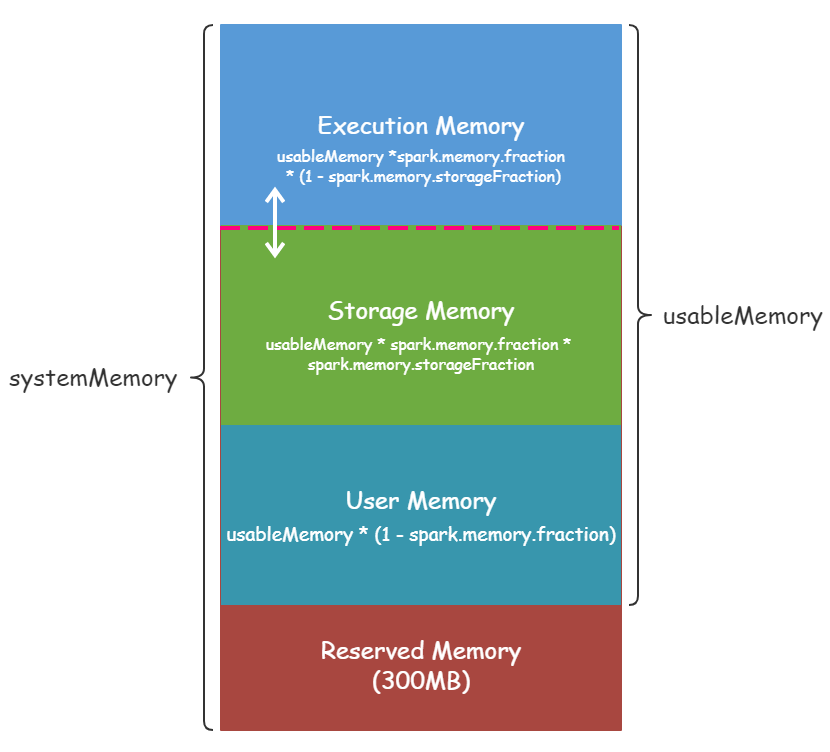

## Spark 内存模型 统一内存管理器机制(UnifiedMemoryManage)
> Spark1.6 以后既能使用JVM堆内存(on-heap), 也能使用堆外内存(off-heap), Executor中的堆上内存区域大致可分为以下四个块  

-- Storage Memory: 
> 它主要用于存储Spark缓存数据, 如RDD缓存、广播变量、展开数据(Unroll data)等,
> 公式： storageMemory = （java heap memory - 300MB）* spark.memory.fraction * spark.memory.storageFraction, 
> 如果启用了堆外内存, Storage memory是堆内的Storage memory和堆外的Storagen memory之和.

-- Execution Memory:
> 主要用于存储Shuffle, Join, Sort, Aggregation等计算过程中的临时数据, 如果没有足够的内存可用, 这个还支持溢出到磁盘上, 但是这个池中的块不能被其他线程(任务)强制清除.
> 公式 : executorMemory = （java heap memory - 300MB）* spark.memory.fraction * (1 - spark.memory.storageFraction)
> 如果启用了堆外内存, Execution memory是堆内的Execution memory和堆外的Execution memory之和.

-- User Memory: 
> 它主要用于存储RDD转换操作所需的数据, 例如RDD依赖关系的用户定义数据结构或SPARK内部元数据信息
> 公式：userMemory = （java heap memory - 300MB）* (1 - spark.memory.fraction)

-- Reserved Memory: 
> 系统保留内存用于存储Spark的内部对象， 从Spark 1.6.0开始,它的值为300MB, 这意味着这300MB 内存不参与Spark内存大小分配的计算.
> 可以重新编译Spark或设置 spark.testing.reservedMemory来改变它的大小,
> 不推荐使用reservedMemory参数, 因为它是一个不打算在生产中使用的测试参数. 请注意此内存只称为"预留", 实际上Spark并不以任何方式使用它，但它为Spark的使用设置了限制. 
> 即使希望为Spark提供所有Java堆来缓存数据, 也无法这样做, 因为这个"保留的"部分仍然是空闲的(不是真正的空闲, 它将存储大量Spark内部对象), 如果您不给Spark executor至少1.5 *预留内存= 450MB堆, 它将失败, 并发出“请使用更大的堆大小”错误消息.

### 堆内内存与堆外内存

### 堆内内存

spark.memory.fraction  default: 0.6  即: Spark Memory（Execution Memory + Storage Memory）默认占整个usableMemory（systemMemory - Reserved Memory）内存的60%   

### 堆外内存 
为了进一步优化内存的使用减小GC开销, Spark 1.6版本还增加了对Off-heap Memory的支持, 堆外内存划分上没有了用户内存与预留内存, 只包含Execution Memory和Storage Memory两块区域  
spark.memory.offHeap.enabled  default: true  
spark.memory.offHeap.size     default:   
spark.memory.storageFraction  default: 0.5  代表Storage Memory占用Spark Memory百分比, 默认值0.5表示Spark Memory中Execution Memory和Storage Memory各占一半    
  

### 总结

> Storage与Execution区域之间的虚线, 代表Storage与Execution内存的容量是可以动态变化的, 比如Storage内存不足的时候, 可以占用Execution的内存, 但是on-heap中的Storage不可以占用off-heap中的Execution内存, 因为on-heap及off-heap整个的大小是固定的, 没法互相占用

> Storage与Execution空间都不足时, 都需要溢写至磁盘; Execution空间不足时, 若有空间被Storage借用, 该空间可以通过淘汰或转存磁盘的方式归还; Storage空间不足时,若有空间被Execution借用, 则无法立即归还, 只能等待用完释放

> Spark对堆内内存的管理是一种逻辑上的"规划式"的管理, 因为对象实例占用内存的申请和释放都由JVM完成, Spark只能在申请后和释放前记录这些内存.
> 说白了Spark只是个记账的，记录每次申请了多少内存, 就能算出还剩多少内存. 然而这个内存的帐并不是那么容易精确记录的, 往往会对不上帐. 
> 首先，对于off-heap堆外内存来说, 存可以比较精确地申请和释放,问题不大. 对于on-heap内存来说，序列化的对象可以精确计算大小, 但非序列化的对象就只能估算了(出于性能考虑), 所以存在记账的内存大小不准的情况,另外on-heap内存的回收是JVM自动进行的,
> 账本上释放掉的内存空间, 不一定已经被回收, 因为记账的不准, 所以即使进行了内存管理还是会有OOM的风险.

* [Spark Core 内存模型](https://liam-blog.ml/2020/02/29/spark-core-memory) 