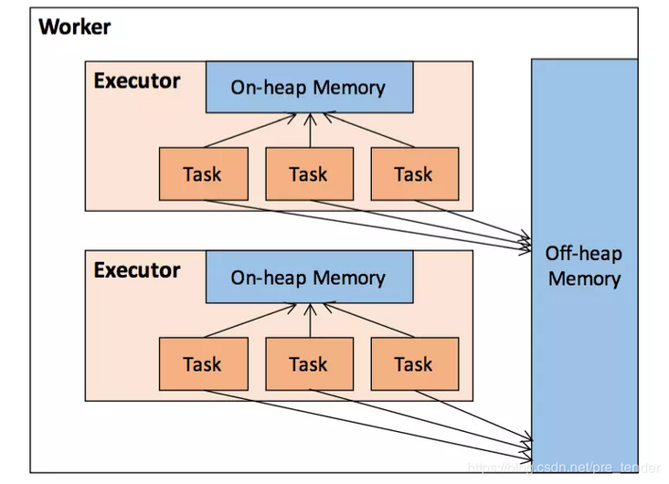
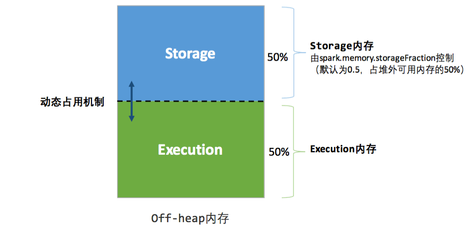

## Spark 内存模型
Spark既能使用JVM堆内存(on-heap)，也能使用堆外内存(off-heap)

### 堆内内存与堆外内存

### 堆内内存

### 堆外内存

### 总结

>> Storage与Execution区域之间的虚线，代表Storage与Execution内存的容量是可以动态变化的，比如Storage内存不足的时候，可以占用Execution的内存,但是on-heap中的Storage不可以占用off-heap中的Execution内存，因为on-heap及off-heap整个的大小是固定的，没法互相占用。

>> Storage与Execution空间都不足时，都需要溢写至磁盘；Execution空间不足时，若有空间被Storage借用，该空间可以通过淘汰或转存磁盘的方式归还；Storage空间不足时，若有空间被Execution借用，则无法立即归还，只能等待用完释放。

>> Spark对堆内内存的管理是一种逻辑上的"规划式"的管理，因为对象实例占用内存的申请和释放都由JVM完成, Spark只能在申请后和释放前记录这些内存.
>> 说白了Spark只是个记账的，记录每次申请了多少内存，就能算出还剩多少内存。然鹅这个内存的帐并不是那么容易精确记录的，往往会对不上帐。
>> 首先，对于off-heap堆外内存来说，内存可以比较精确地申请和释放，问题不大。对于on-heap内存来说，序列化的对象可以精确计算大小，
>> 但非序列化的对象就只能估算了(出于性能考虑)，所以存在记账的内存大小不准的情况。另外，on-heap内存的回收是JVM自动进行的，
>> 账本上释放掉的内存空间，不一定已经被回收。因为记账的不准，所以即使进行了内存管理还是会有OOM的风险.

* [Spark Core 内存模型](https://liam-blog.ml/2020/02/29/spark-core-memory) 