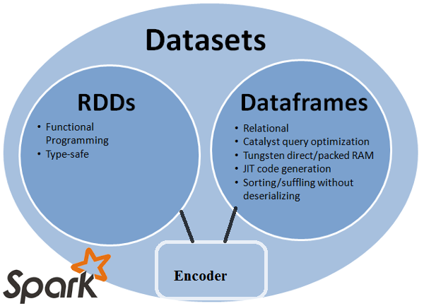
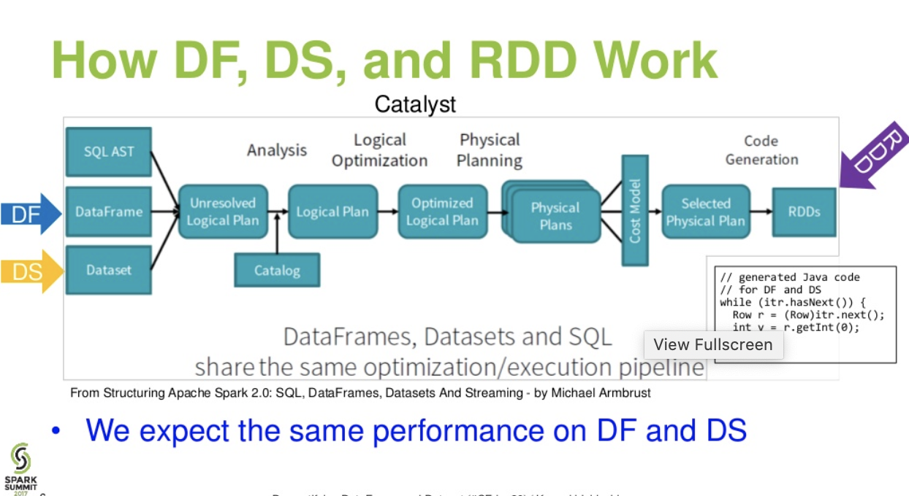
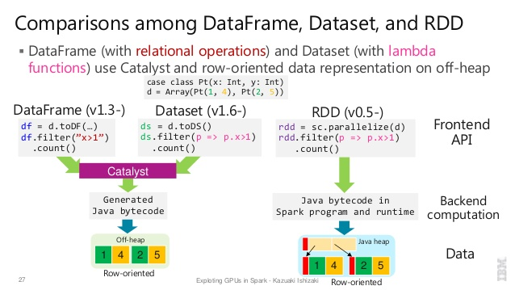

## 优化参数
-- https://spark.apache.org/docs/latest/configuration.html
-- https://tech.meituan.com/2016/05/12/spark-tuning-pro.html
-- https://cloud.tencent.com/developer/article/1665706

--driver-memory  运行sparkContext的Driver所在所占用的内存，通常不必设置，设置的话1G就足够了，除非是需要使用collect之类算子经常需要将数据提取到driver中的情况.
对于大数据集的计算结果，不要使用collect() 很容易撑爆driver的内存，一般直接输出到分布式文件系统中
Maximum heap size settings can be set with  spark.driver.memory  in the cluster mode and through the --driver-memory command line option in the client mode.

--num-executors   主要用于设置该应用总共需要多少executors来执行   这个值得设置还是要看分配的队列的资源情况，太少了无法充分利用集群资源，太多了则难以分配需要的资源
command line option: --num-executors  
Interactive mode:    spark.num.executors

--executor-memory  每个executor并行执行task的能力       num-executor x executor-cores 不能超过分配队列中cpu核数的大小  如果将内存设置的很大, GC所产生的消耗, 通常推荐每一个Executor的内存<=64 GB

command line option: --executor-memory  
Interactive mode:    spark.executor.memory  

--executor-cores  每个executor的内存         num-executor x executor-memory的大小绝不能超过队列的内存总大小

command line option:   --executor-cores  
Interactive mode:    spark.executor.cores

--spark.sql.codegen  取更好的表达式查询速度

--conf spark.default.parallelism  此参数用于设置每个stage经TaskScheduler进行调度时生成task的数量
此参数未设置时将会根据读到的RDD的分区生成task, 即根据源数据在hdfs中的分区数确定, 若此分区数较小, 则处理时只有少量task在处理, 前述分配的executor中的core大部分无任务可干. 
通常可将此值设置为num-executors*executor-cores的2-3倍为宜, 如果与其相近的话, 则对于先完成task的core则无任务可干, 2-3倍数量关系的话即不至于太零散, 又可使得任务执行更均衡.

--conf spark.sql.shuffle.partitions         shuffle时候的Task数量, 该参数代表了shuffle read task的并行度  default: 200     
调节的基础是spark集群的处理能力和要处理的数据量, spark的默认值是200, 切分更多的task有助于数据倾斜的减缓 ,但shuffle数据量也会增多, Task过多也会产生很多的任务启动开销， Task过少, 每个Task的处理时间过长容易straggle.

--conf spark.sql.autoBroadcastJoinThreshold    default: 100MB    
-1时， broadcasting不可用, 对于broadcast join模式，会将小于spark.sql.autoBroadcastJoinThreshold值（默认为10M）的表广播到其他计算节点,不走shuffle过程，所以会更加高效, 内存允许的情况下加大这个值.

-- spark.executor.memoryOverhead   default: max(executorMemory*0.1, 384)M  

-- spark.memory.offHeap.enabled  default: true  
If true, Spark will attempt to use off-heap memory for certain operations. If off-heap memory use is enabled, then spark.memory.offHeap.size must be positiv

--conf spark.memory.offHeap.size  default: 0   真正作用于spark executor的堆外内存
The absolute amount of memory in bytes which can be used for off-heap allocation. This setting has no impact on heap memory usage, 
so if your executors' total memory consumption must fit within some hard limit then be sure to shrink your JVM heap size accordingly. 
This must be set to a positive value when spark.memory.offHeap.enabled=true.

需要设置堆外内存时候，什么时候需要对外内存，我觉得是任何时候，因为你不知道executor因内存不足oom， 使用时 spark.executor.memoryOverhead设置最好大于等于 spark.memory.offHeap.size

-- spark.sql.adaptive.coalescePartitions.minPartitionNum   shuffle 分区合并后的最小分区数，默认为spark集群的默认并行度

-- spark.sql.adaptive.advisoryPartitionSizeInBytes  default: 64M  建议的shuffle分区的大小，在合并分区和处理join数据倾斜的时候用到

-- spark.sql.adaptive.skewJoin.enabled  default: true  是否开启join中数据倾斜的自适应处理

-- spark.sql.autoBroadcastJoinThreshold  default: 100MB   对于broadcast join模式, 会将小于spark.sql.autoBroadcastJoinThreshold 值的表广播到其他计算节点, 不走shuffle过程, 所以会更加高效
,确定broadcast hash join的决定性因素是hive的表统计信息一定要准确, 由于视图是没有表统计信息的, 所以所有的视图在join时都不会被广播

Configures the maximum size in bytes for a table that will be broadcast to all worker nodes when performing a join. By setting this value to -1 broadcasting can be disabled.

${SPARK_SQL_CMD} \
--master yarn \
--queue root.bi \
--name "${job_name}" \
--driver-memory 8G \
--executor-memory 7G \
--conf spark.sql.shuffle.partitions=2000 \
--conf spark.executors.cores=4 \
--conf spark.executor.memoryOverhead=1G \
--conf spark.memory.offHeap.size=1G \
--conf spark.sql.adaptive.coalescePartitions.minPartitionNum=10 \
--conf spark.sql.adaptive.advisoryPartitionSizeInBytes=268435456 \
--conf spark.local.dir=viewfs://ss-hadoop/project/ads/warehouse/tmp/.scratch \
-d day="${day}" \
-d hour="${hour}" \
-d basedir="${basedir}" \
-f "${sql_file}"

## Difference between SparkContext, JavaSparkContext, SQLContext, and SparkSession
1. SparkContext
> Main entry point for Spark functionality. A SparkContext represents the connection to a Spark cluster, and can be used to create RDDs, accumulators and broadcast variables on that cluster.
> Only one SparkContext may be active per JVM. You must stop() the active SparkContext before creating a new one. This limitation may eventually be removed; see SPARK-2243 for more details.

2. JavaSparkContext 
> A Java-friendly version of [[org.apache.spark.SparkContext]] that returns [[org.apache.spark.api.java.JavaRDD]]s and works with Java collections instead of Scala ones.
> Only one SparkContext may be active per JVM. You must stop() the active SparkContext before creating a new one. This limitation may eventually be removed; see SPARK-2243 for more details.

3. SQLContext
> The entry point for working with structured data (rows and columns) in Spark 1.x.
> As of Spark 2.0, this is replaced by [[SparkSession]]. However, we are keeping the class here for backward compatibility.

4. SparkSession 
> The entry point to programming Spark with the Dataset and DataFrame API.

> SQLContext is entry point of SparkSQL which can be received from sparkContext. Prior to 2.x.x, RDD ,DataFrame and Data-set were three different data abstractions.
> Since Spark 2.x.x, All three data abstractions are unified and SparkSession is the unified entry point of Spark.

## Difference between DataFrame, Dataset, and RDD in Spark
1. History of Spark API  

2. RDD
> The main abstraction Spark provides is a resilient distributed dataset (RDD), which is a collection of elements partitioned across the nodes of the cluster that can be operated on in parallel.

### RDD Features:
-- Distributed collection:
> RDD uses MapReduce operations which is widely adopted for processing and generating large datasets with a parallel, distributed algorithm on a cluster. It allows users to write parallel computations, using a set of high-level operators, without having to worry about work distribution and fault tolerance.

-- Immutable: 
> RDDs composed of a collection of records which are partitioned. A partition is a basic unit of parallelism in an RDD, and each partition is one logical division of data which is immutable and created through some transformations on existing partitions.Immutability helps to achieve consistency in computations.

-- Fault tolerant:
> In a case of we lose some partition of RDD , we can replay the transformation on that partition in lineage to achieve the same computation, rather than doing data replication across multiple nodes.This characteristic is the biggest benefit of RDD because it saves a lot of efforts in data management and replication and thus achieves faster computations.

-- Lazy evaluations:
> All transformations in Spark are lazy, in that they do not compute their results right away. Instead, they just remember the transformations applied to some base dataset . The transformations are only computed when an action requires a result to be returned to the driver program.

-- Functional transformations: 
> RDDs support two types of operations: transformations, which create a new dataset from an existing one, and actions, which return a value to the driver program after running a computation on the dataset.

-- Data processing formats:
> It can easily and efficiently process data which is structured as well as unstructured data.

-- Programming Languages supported:
>RDD API is available in Java, Scala, Python and R.

###  RDD Limitations:
-- No inbuilt optimization engine:
> When working with structured data, RDDs cannot take advantages of Spark’s advanced optimizers including catalyst optimizer and Tungsten execution engine. Developers need to optimize each RDD based on its attributes.

-- Handling structured data: 
> Unlike Dataframe and datasets, RDDs don’t infer the schema of the ingested data and requires the user to specify it.

3. Dataframe
> A DataFrame is a distributed collection of data organized into named columns. It is conceptually equivalent to a table in a relational database or a R/Python Dataframe. 
> Along with Dataframe, Spark also introduced catalyst optimizer, which leverages advanced programming features to build an extensible query optimizer.

### Dataframe Features:
A DataFrame is a distributed collection of data organized into named columns. It is conceptually equivalent to a table in a relational database or a R/Python Dataframe. 
Along with Dataframe, Spark also introduced catalyst optimizer, which leverages advanced programming features to build an extensible query optimizer.

-- Distributed collection of Row Object: 
> A DataFrame is a distributed collection of data organized into named columns. It is conceptually equivalent to a table in a relational database, but with richer optimizations under the hood.

-- Data Processing: 
> Processing structured and unstructured data formats (Avro, CSV, elastic search, and Cassandra) and storage systems (HDFS, HIVE tables, MySQL, etc). It can read and write from all these various datasources.

-- Optimization using catalyst optimizer: 
> It powers both SQL queries and the DataFrame API. Dataframe use catalyst tree transformation framework in four phases:
 a.Analyzing a logical plan to resolve references
 b.Logical plan optimization
 c.Physical planning
 d.Code generation to compile parts of the query to Java bytecode.
Hive Compatibility: Using Spark SQL, you can run unmodified Hive queries on your existing Hive warehouses. It reuses Hive frontend and MetaStore and gives you full compatibility with existing Hive data, queries, and UDFs.

-- Tungsten: 
> Tungsten provides a physical execution backend whichexplicitly manages memory and dynamically generates bytecode for expression evaluation.

-- Programming Languages supported:
> Dataframe API is available in Java, Scala, Python, and R.

### Dataframe Limitations:-
-- Compile-time type safety: 
> As discussed, Dataframe API does not support compile time safety which limits you from manipulating data when the structure is not know. The following example works during compile time. However, you will get a Runtime exception when executing this code.

4. Dataset
> Dataset API is an extension to DataFrames that provides a type-safe, object-oriented programming interface. It is a strongly-typed, immutable collection of objects that are mapped to a relational schema.

> At the core of the Dataset, API is a new concept called an encoder, which is responsible for converting between JVM objects and tabular representation. 
> The tabular representation is stored using Spark internal Tungsten binary format, allowing for operations on serialized data and improved memory utilization. 
> Spark 1.6 comes with support for automatically generating encoders for a wide variety of types, including primitive types (e.g. String, Integer, Long), Scala case classes, and Java Beans.

### Dataset Features:
-- Provides best of both RDD and Dataframe: 
> RDD(functional programming, type safe), DataFrame (relational model, Query optimazation , Tungsten execution, sorting and shuffling)

-- Encoders: 
> With the use of Encoders, it is easy to convert any JVM object into a Dataset, allowing users to work with both structured and unstructured data unlike Dataframe.

-- Programming Languages supported: 
> Datasets API is currently only available in Scala and Java. Python and R are currently not supported in version 1.6. Python support is slated for version 2.0.

-- Type Safety: 
> Datasets API provides compile time safety which was not available in Dataframes. In the example below, we can see how Dataset can operate on domain objects with compile lambda functions.

### Datasets API Limitation:
-- Requires type casting to String: 
> Querying the data from datasets currently requires us to specify the fields in the class as a string. Once we have queried the data, we are forced to cast column to the required data type. On the other hand, if we use map operation on Datasets, it will not use Catalyst optimizer.

-- Difference  

5. How DF DS and RDD to work  

6. Nice comparison of all of them with a code snippet  

* [Difference between DataFrame, Dataset, and RDD in Spark](https://stackoverflow.com/questions/31508083/difference-between-dataframe-dataset-and-rdd-in-spark) 

